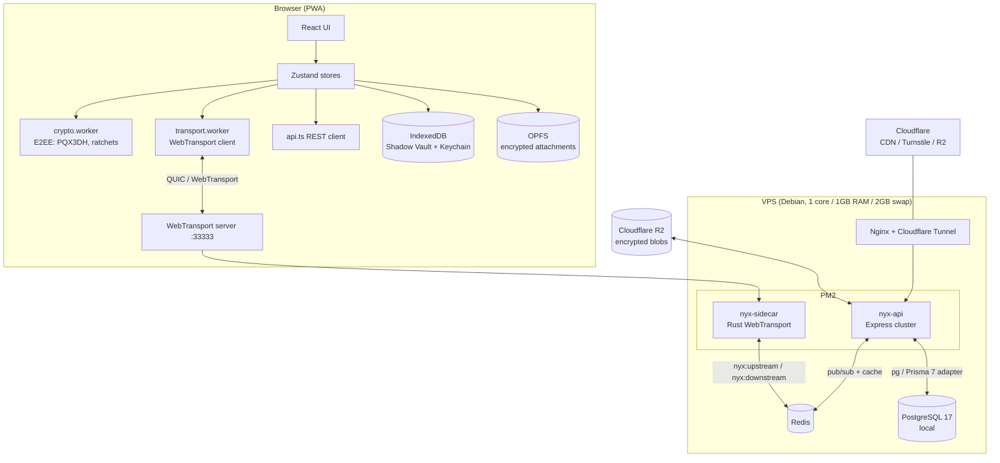

# 01 — Architecture

## 1.1 Repository layout

```
nyx-chat/
├── web/                      # React 19 + Vite 8 PWA (the messenger client)
│   ├── src/
│   │   ├── components/       # UI components (~90 files)
│   │   ├── pages/            # Lazy-loaded route pages (Login, Register, Chat, Settings…)
│   │   ├── store/            # 20 Zustand stores
│   │   ├── hooks/            # Reusable React hooks
│   │   ├── lib/              # Infrastructure: api, transport, storage, crypto proxies
│   │   ├── utils/            # Pure helpers (crypto.ts is the biggest; kept monolithic by design)
│   │   ├── workers/          # crypto.worker.ts (E2EE) + transport.worker.ts (WebTransport)
│   │   ├── main.tsx          # Entry — imports zodSetup FIRST, then boots i18n before render
│   │   ├── App.tsx           # Routing + global modals (lazy, render-on-demand)
│   │   └── sw.ts             # Service worker (precache only, no /api caching)
│   ├── public/locales/       # i18n: en, es, id, pt-BR × 7 runtime namespaces
│   └── e2e/                  # Playwright specs
├── server/                   # Express 5 API (ESM TS, run via tsx)
│   ├── src/
│   │   ├── routes/           # 17 route modules
│   │   ├── middleware/       # requireAuth, rateLimiter, tenantAuth
│   │   ├── network/          # redisBridge.ts — Redis pub/sub ↔ Rust sidecar
│   │   ├── jobs/             # messageSweeper, systemSweeper (node-cron)
│   │   ├── lib/              # prisma.ts, redis.ts, sodium.ts
│   │   └── utils/            # sessionUtils, validate (safeEqualStrings), mappers, jwt…
│   ├── prisma/               # schema.prisma, seed, migrations (baseline 0_init)
│   ├── scripts/              # reset-test-env.ts (E2E DB wipe)
│   └── transport-sidecar/    # Rust WebTransport server (wtransport crate)
├── packages/
│   ├── shared/               # @nyx/shared — types, zod schemas, opcodes, constants (consumed from dist/)
│   └── (nyx-sdk removed — do not recreate)
├── marketing/                # Astro static site (independent; no imports from web/)
├── docs/                     # This documentation
└── .github/workflows/        # ci.yml, deploy.yml, codeql, gemini-* agent workflows
```

## 1.2 Runtime architecture



- **API is a blind relay.** All message content, profiles, and keys are encrypted client-side. The server never holds plaintext.
- **Realtime path:** browser → QUIC → Rust sidecar → Redis pub/sub → Node (`redisBridge`) → Prisma → Redis → sidecar → recipient.
- **REST path:** browser → Cloudflare → nginx → Express → Prisma/Redis (auth, keys, uploads, sync, admin).

## 1.3 Dependency boundaries (verified)

- `@nyx/shared` is imported by web and server **from `dist/`** (`main: dist/index.js`). Always rebuild it before typechecking consumers.
- Web and server share no runtime code besides `@nyx/shared`.
- `marketing/` is fully independent (no imports from `web/src`).
- `server/transport-sidecar` communicates with Node **only** through Redis pub/sub — no HTTP between them.
- The crypto worker is reached exclusively through `crypto-worker-proxy.ts` (typed request/response protocol with request IDs).

## 1.4 Data ownership

| Data | Location | Plaintext ever? |
|---|---|---|
| Messages | Sender device IDB (Shadow Vault) + server DB (ciphertext, ≤14 days) | Only on end devices |
| Keys (ratchet/session/chain) | Device IDB (encrypted at rest with `ENC1:` envelope) | In memory during use |
| Profiles | Server DB (encrypted blob) + device profile cache | During UI render |
| Attachments | Cloudflare R2 (encrypted blobs) + OPFS cache (encrypted) | During render |
| Stories | Server DB (encrypted) + local story keys | During render |

## 1.5 Key entry points

- **Web:** `web/src/main.tsx` → `App.tsx` → routes; store wiring in `web/src/lib/socketListeners.ts` (`initSocketListeners` runs once at import).
- **Server:** `server/src/index.ts` → connects Redis first, then loads `app.ts` and `redisBridge.ts`; HTTP server on `:4000`.
- **Sidecar:** `server/transport-sidecar/src/main.rs` — binds UDP `:33333`, accepts WebTransport sessions, publishes to `nyx:upstream:<op>`.
