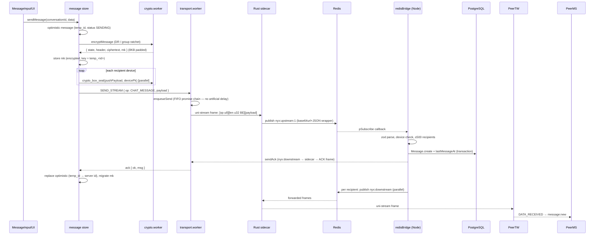
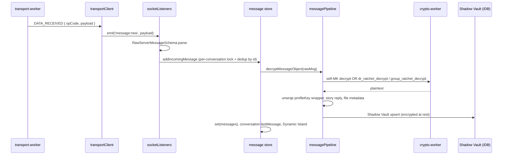

# 05 — Message Pipeline (send → receive, end to end)

## 5.1 Send path



### Notes

- **Optimistic UI:** the bubble appears instantly; ack replaces it with the server message.
- **Crypto is serial, sealing is parallel:** the ratchet step is one worker round-trip; push sealing for N recipient devices runs with `Promise.all`.
- **No chaff delay:** real frames go out immediately through a FIFO promise chain; chaff is a separate idle timer (~3s, 1000B datagrams).
- **Offline:** if the transport is down, messages are queued in IndexedDB (`offlineQueueDb`) and flushed on reconnect (`processOfflineQueue` on the `connect` event).

## 5.2 Receive path



### Failure semantics

- Missing key → `waiting_for_key` (retryable; auto-healed via `reDecryptPendingMessages` / session-key repair).
- Own message that fails every path → `waiting_for_key`, never an error bubble (Shield keeps the valid local copy).
- Control messages (`GROUP_KEY_DISTRIBUTION`, `STORY_KEY`, `PROTOCOL_RESET`, …) are evaluated by `evaluateControlMessage` and never rendered.

## 5.3 Wire formats

### Client ↔ sidecar frame

```
[ op_code: u8 ][ length: u32 big-endian ][ payload bytes ]
```

- Unidirectional streams: message payloads.
- Datagrams: chaff (and small events).
- Bidirectional stream #1: AUTH (`0x00` + JSON `{token, identity:{fingerprint, installationId}}`); ACK frames come back on the same stream for HANDSHAKE.

### Redis pub/sub envelope

Sidecar publishes:

```json
{ "user_id": "...", "device_id": "...", "op_code": 1, "payload": "<base64url>", "is_datagram": false }
```

Node publishes to `nyx:downstream` in the same shape; the sidecar frames and forwards it to the target session.

### TransportOpCode

| Code | Meaning |
|---|---|
| 0x00 | CHAFF (datagrams/uni, ignored) / AUTH (bidi only) |
| 0x01 | CHAT_MESSAGE |
| 0x02 | KEY_SYNC (session keys, control events, burner) |
| 0x03 / 0x04 | WEBRTC_SIGNAL / WEBRTC_ICE |
| 0x05 | PRESENCE |
| 0x06 | ACK |
| 0x07 | KICK |
| 0x0A | HANDSHAKE |

⚠ The Rust sidecar hardcodes these numbers — keep `packages/shared/src/transport.ts` and `transport-sidecar/src/main.rs` in sync.

## 5.4 REST fallbacks

- **Auth/keys/upload/sync/admin** are REST (`web/src/lib/api.ts` — single client: `api`, `authFetch`, `apiUpload`).
- Message history sync on reconnect: `GET /api/messages/:conversationId?limit=250` + `GET /api/conversations/sync`.
- REST message send exists (`POST /api/messages`) but the client uses WebTransport when connected.
- Reconnect: exponential backoff 1s→30s with jitter, skipped entirely when logged out.

## 5.5 Ordering & dedup guarantees

- Per-conversation **incoming lock** serializes `doAddIncomingMessage` (no interleaved ratchet advances).
- Duplicate delivery (live event vs REST sync) is deduped by message id.
- Transport FIFO chain preserves client send order per connection.
- Sequence numbers across reconnects do not exist — ordering relies on `createdAt` in the UI.
