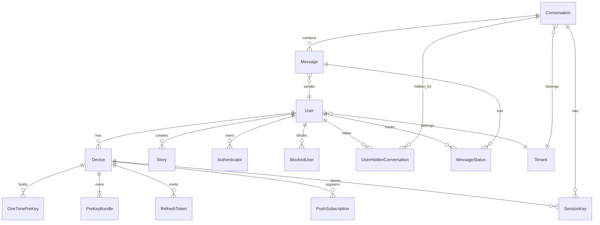

# 09 — Database

## 9.1 Overview

- PostgreSQL (17 in prod), accessed exclusively through Prisma 7 with `@prisma/adapter-pg` (`server/src/lib/prisma.ts`).
- **Migration flow: `prisma db push`** (no `migrate deploy`). `prisma.config.ts` resolves `DIRECT_URL || DATABASE_URL` (dotenv).
- `server/prisma/migrations/0_init/` is a baseline SQL snapshot for history; deployments apply schema via `prisma db push` in CI and on the VPS.

## 9.2 Schema (15 tables)

| Table | Purpose |
|---|---|
| `User` | usernameHash, passwordHash, encryptedProfile blob, trust tier, subscription, auto-destruct, ban state |
| `Device` | per-device identity/public keys (X25519 + ML-KEM + Ed25519), fingerprint + installationId anchors |
| `OneTimePreKey` / `PreKeyBundle` | PQX3DH key material (blind) |
| `RefreshToken` | rotating refresh tokens with `familyId` reuse detection |
| `SessionKey` | blind-relayed session keys (initiator ciphertexts) |
| `PushSubscription` | Web Push endpoints per device |
| `Conversation` | isGroup, encryptedMetadata blob, `authSecret` (blind auth for group ops) |
| `Message` | store-and-forward ciphertext (≤14 days), `deleteSecret`, view-once flags |
| `MessageStatus` | delivery/read receipts |
| `UserHiddenConversation` | per-user conversation visibility (Opaque Mailbox discovery) |
| `Story` | encrypted story blobs with expiry |
| `Authenticator` | WebAuthn credentials |
| `BlockedUser` | block lists |
| `Tenant` | B2B multi-tenancy (apiKey, allowed domains) |

## 9.3 Indexes

Notable indexes:

- `Message`: `[conversationId, createdAt DESC]`, `senderId`, `sessionId`, `createdAt`, `repliedToId`, **`expiresAt`** (sweeper).
- `SessionKey`: `[conversationId, deviceId, sessionId]` unique + **`expiresAt`**.
- `RefreshToken`: `jti` unique, `familyId`, `expiresAt`, `deviceId`, `revokedAt`.
- `UserHiddenConversation`: `[userId, conversationId]` unique.

## 9.4 At-rest data (server side)

Everything user-generated is opaque: `Message.content`, `Conversation.encryptedMetadata`, `User.encryptedProfile`, `Story.encryptedPayload`. Only hashes, opaque IDs, timestamps, and public keys are readable server-side.

## 9.5 Sweepers & retention

- Messages: hard expiry at `expiresAt` or 14 days, whichever comes first (minute sweep, notified to clients).
- Blobs in R2 are **blind** (server can't read keys) — configure an R2 lifecycle rule (e.g. delete after 30 days) so orphaned encrypted blobs don't accumulate.
- Session keys / OTPKs: daily sweep.

## 9.6 Backup (prod VPS)

- Cron `15 3 * * *` runs `/root/backup-nyx-db.sh`: `pg_dump -Fc` → `/root/backups/nyx_<date>.dump`, 7-day retention.
- Restore: `pg_restore -h 127.0.0.1 -U nyx -d nyx_app <dump>`. Password lives in `/root/.nyx_db_pass` (0600).

## 9.7 Schema changes checklist

1. Edit `server/prisma/schema.prisma`.
2. `npx prisma generate` (always — clients embed the schema).
3. `PRISMA_USER_CONSENT_FOR_DANGEROUS_AI_ACTION="…" npx prisma db push` against a local DB first.
4. Ship: CI `prisma db push` (ephemeral DB) + VPS deploy script `prisma db push` (prod, guarded by consent env).
5. Update `docs/09-database.md` and regenerate `server/prisma/migrations/0_init/migration.sql` if you want the baseline refreshed.
