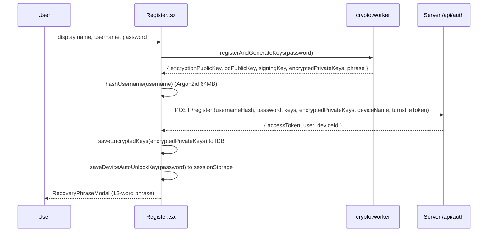
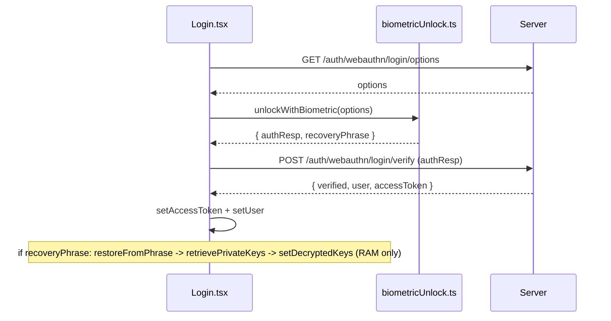

# 14 — Authentication, Identity & Device Management

This document traces every authentication and identity flow end-to-end: what the client does, what the server does, and which files are involved. Read this together with `03-security-model.md` (threat model) and `04-crypto-protocol.md` (the crypto primitives).

## 14.1 Identity model

NYX has no phone number or email. Identity is built from three independent pieces:

| Piece | Where it lives | Purpose |
|---|---|---|
| `usernameHash` (blind index) | Server (`User.usernameHash`, unique) | Findable-but-anonymous handle. Computed client-side with Argon2id (64 MB, 3 iter). The server cannot reverse it. |
| Device key bundle | Server (`Device` + `PreKeyBundle` + `OneTimePreKey`) | X25519 + ML-KEM-768 (X-Wing) identity, signed pre-keys, signing key, OTPKs. Used for PQX3DH. |
| Encrypted private keys | Client (`IndexedDB kvStore.nyx_encrypted_keys`) | The master seed, encryption keys, signing key — encrypted at rest with a password-derived KEK (Argon2id). |

**Key files:** `web/src/store/auth.ts`, `web/src/lib/keyStorage.ts`, `web/src/lib/crypto-worker-proxy.ts`, `web/src/workers/crypto.worker.ts`, `web/src/utils/crypto.ts`, `web/src/utils/fingerprint.ts`, `server/src/routes/auth.ts`, `server/src/routes/users.ts`, `server/src/routes/keys.ts`, `server/src/routes/sessions.ts`.

## 14.2 Registration (anonymous)



- **Proof-of-Work (anti-bot):** `Register.tsx` mines a BLAKE2b/Argon2 challenge via `minePoW` before/around registration; the server issues `GET /api/auth/pow/challenge` and validates `POST /api/auth/pow/verify`. Turnstile is optional and uses `VITE_TURNSTILE_SITE_KEY` (dummy key in dev).
- **Profile:** the display name/bio/avatar are encrypted into `encryptedProfile` (ghost profile) — see §14.9.

## 14.3 Login — password

```mermaid
sequenceDiagram
    participant L as Login.tsx
    participant S as Server
    L->>S: POST /auth/login (usernameHash, password, deviceId?, fingerprint, installationId)
    S-->>L: { user, accessToken, encryptedPrivateKey?, deviceId? }
    L->>L: saveEncryptedKeys if new device; saveDeviceAutoUnlockKey(password)
    L->>L: retrievePrivateKeys(stored, password) -> set hasRestoredKeys
```

- `auth.login()` sets `isUnlocking: true` while decrypting keys, so the "New Device Detected" recovery modal does not flash (`Login.tsx` gates the modal on `!isUnlocking`).
- **Hardware binding:** the server stores `fingerprint` + `installationId` on the device. A login from a different installation with the same account triggers the recovery flow (identity keys are device-bound).

## 14.4 Login — biometric (WebAuthn PRF)

Biometric login uses WebAuthn with the PRF extension to derive a symmetric key that unlocks the vault **without the password**.



- **PRF key derivation** (`biometricUnlock.ts`): the PRF salt is `NYX_CYPHERPUNK_LOCAL_UNLOCK_SALT_V1` hashed via BLAKE2b. `setupBiometricUnlock` encrypts the recovery phrase into `localStorage.nyx_bio_vault` with the PRF key; `unlockWithBiometric` decrypts it back.
- **Important invariant (recent fix):** biometric unlock sets decrypted keys **in memory only** (`setDecryptedKeys`). It must **not** overwrite `nyx_encrypted_keys` in IndexedDB — otherwise the password-derived bundle is replaced with a random session key and password login breaks. Password and biometric unlock are fully independent.

## 14.5 Refresh token rotation & silent refresh

- Cookies: `at` (access, 15 min) and `rt` (refresh, 30 days), both `httpOnly`, `SameSite=None; Secure` in prod.
- `POST /api/auth/refresh` rotates the refresh token: marks the old one `revokedAt`, creates a new row chained via `replacedById`, same `familyId`.
- **Reuse detection:** a presented token that is already revoked/replaced is normally a theft signal → the whole family is revoked and the user is force-logged-out. A **5-second grace window** treats a same-device, recently-rotated duplicate as a benign concurrent refresh (multi-tab) and continues the chain instead of revoking.
- **Client side:** `auth.silentRefresh()` is single-flight per tab (`refreshPromise`) and serialized across tabs via `web/src/lib/refreshLock.ts` (Web Locks API, localStorage fallback). It retries up to 3× before giving up.
- **Bootstrap resilience:** on app load, `bootstrap()` tries `silentRefresh()`, then falls back to a direct `GET /api/users/me` (using the still-valid `at` cookie) before logging out. A transient refresh failure no longer nukes the session.

## 14.6 Account recovery & "new device"

- **Recovery phrase:** a 12-word mnemonic that encodes the master seed. `restoreFromPhrase` regenerates the whole key bundle deterministically.
- **`/restore`:** restores keys from the phrase, then logs in with `restoredNotSynced` to re-sync keys to the server.
- **`POST /api/auth/recover`:** recovers a *lost* account using a signature proof over the username hash + new password + new keys (`crypto_sign_verify_detached` against any device signing key). Wipes all devices + authenticators and recreates one.
- **New device gate:** `ProtectedRoute` redirects to `/login` while `hasRestoredKeys === false`; `Login.tsx` auto-opens the recovery-options modal only after login state settles (the `isUnlocking` guard).

## 14.7 Single active device & sessions

- The Rust sidecar enforces **one active WebTransport session per user** (kicking the previous one with `SESSION_REVOKED`).
- `SessionManagerPage` lists sessions (`GET /api/sessions`) and revokes by JTI (`DELETE /api/sessions/:jti` → family revoke + Redis JTI blacklist + KICK + `force_logout`).
- `POST /api/auth/logout-all` revokes every session and blacklists all JTIs.

## 14.8 Trust tiers, panic & emergency eject

- **Trust tier** (`verification.ts`): new accounts are **Sandbox** (rate-limited). Becoming **VIP** requires either WebAuthn registration or solving a PoW challenge (`/api/auth/pow/*`).
- **Panic password** (`keyStorage.ts` `setPanicPassword`/`checkPanicPassword`): a second password whose entry wipes the local vault (Argon2id 19 MB "panic" config).
- **Emergency eject** (`nukeProtocol.ts`): calls `/api/auth/logout-all` first (HttpOnly cookies can't be cleared client-side), then closes the DB, deletes IndexedDB (including dynamically-enumerated stores), OPFS, localStorage/sessionStorage, cookies, unregisters the service worker and redirects.

## 14.9 Ghost profiles & safety numbers

- **Ghost profile:** name/bio/avatar are encrypted with a `ProfileKey` (generated per account) into `encryptedProfile`. The key is shared only with approved contacts via E2EE payloads (`saveProfileKey`/`getProfileKey` in `keychainDb.ts`).
- **Propagation:** when a user edits their profile, the server emits `user:updated` to the user **and to every peer sharing a conversation** (via `UserHiddenConversation`), so chatlist/headers update without waiting for a new message.
- **Safety number** (`utils/safetyNumber.ts`, `SafetyNumberModal`): a fingerprint derived from both users' identity keys; verified state stored per-conversation (`verification.ts`).

## 14.10 Vault export/import & device migration

- `KeyManagementPage` can export the encrypted keychain (`exportDatabaseToJson`) and import it (`importDatabaseFromJson`).
- **Migration protocol** (`MigrationSendPage`/`MigrationReceivePage` + `migration:*` events in the Redis bridge): a QR handshake (`auth:request_linking_qr`), then the vault is streamed chunk-by-chunk over WebTransport (`migration:start`/`migration:chunk`/`migration:ack`), owner-only. During migration `is_migrating:<userId>` allows two devices temporarily.

## 14.11 Files to know

| File | Role |
|---|---|
| `web/src/store/auth.ts` | `bootstrap`, `login`, `registerAndGeneratePhrase`, `silentRefresh`, `tryAutoUnlock`, `lockApp`, `setDecryptedKeys`, key getters |
| `web/src/lib/keyStorage.ts` | encrypted keys, auto-unlock key (sessionStorage), panic password |
| `web/src/lib/biometricUnlock.ts` | WebAuthn PRF setup/unlock |
| `web/src/lib/refreshLock.ts` | cross-tab refresh mutex |
| `web/src/lib/nukeProtocol.ts` | emergency eject |
| `web/src/utils/fingerprint.ts` | `getBrowserFingerprint`, `getPersistentInstallationId` (CSRF key + header) |
| `web/src/utils/safetyNumber.ts` | safety number |
| `web/src/utils/verification.ts` | verified status |
| `server/src/routes/auth.ts` | register/login/refresh/recover/webauthn/pow/burner/logout |
| `server/src/routes/users.ts` | profile, devices, block, search, delete account |
| `server/src/routes/sessions.ts` | session list/revoke |
| `server/src/routes/keys.ts` | prekey bundle, OTPKs, initial session, TURN |
