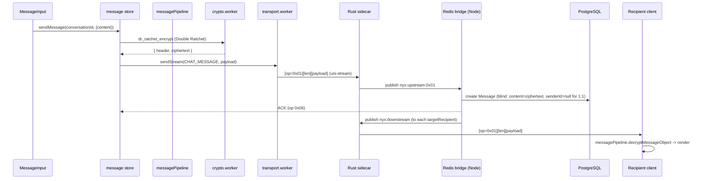

# 15 — Messaging (End-to-End Send/Receive)

How a single message travels from the sender's keystroke to the recipient's screen — and back as a read receipt. Covers the full E2EE pipeline, message statuses, and every message-level feature (reactions, edits, unsend, view-once, silent, expiry, voice).

## 15.1 The core pipeline

- **Encryption** happens in `web/src/workers/crypto.worker.ts` (`dr_ratchet_encrypt` / `group_ratchet_encrypt`); the main thread reaches it via `crypto-worker-proxy.ts`.
- **Decryption** is centralized in `web/src/lib/messagePipeline.ts` (`decryptMessageObject`) — the single source of truth for text + file keys, ratchet handling, and `waiting_for_key` states. Never duplicate this logic in a component.
- **Optimistic UI:** `addOptimisticMessage` writes a temp message (`temp_<ts>`), then `replaceOptimisticMessage` swaps it for the server-confirmed one on ACK.

## 15.2 Sending vs receiving (1:1 and group)

| Path | Encryption | Key source |
|---|---|---|
| 1:1 | Double Ratchet (PQX3DH-seeded) | `SPQR`/`PQ_DR` session state (`ratchetSessions` in IDB, encrypted at rest) |
| Group | Sender-Key ratchet | per-(conversation, sender) sender/receiver state in `keychainDb` (`ENC1:` at rest) |

- The fan-out for groups is **client-side**: the sender distributes its sender key to every member via `messages:distribute_keys` (persisted as a SYSTEM control message for offline delivery).
- Own messages are decrypted back using the stored message key (`mk`), falling back to the DR path; on final failure the message is marked `waiting_for_key` — never an error bubble.

## 15.3 Message statuses & read receipts

- Statuses: `SENT` → `DELIVERED` → `READ`. The server stores `MessageStatus` rows and relays `message:status_updated`.
- **1:1 read = delete:** when a 1:1 message is READ, the server deletes it immediately (`handleMessageStatusUpdate`) — the recipient's device already has the ciphertext and key, so nothing is lost.
- `ChatWindow` batches mark-as-read events and only fires them when the Virtuoso row is actually visible (IntersectionObserver).

## 15.4 Reactions, edits, unsend

All three are **E2EE tombstone control messages** carried through the normal message envelope and evaluated by `evaluateControlMessage` in `messagePipeline.ts`:

| Feature | Payload type | Notes |
|---|---|---|
| Reaction | `reaction` / `reaction_remove` | `sendReaction`; rendered by `ReactionsDisplay` |
| Edit | `edit` | limited to 5-minute window, own messages, non-file, non-system |
| Unsend | `UNSEND` | `message:unsend` → server verifies sender or `deleteSecret` → `message:deleted` |

## 15.5 View-once, silent, expiry

- **View-once:** `isViewOnce` flag; when viewed, the server deletes the message (`message:view_once_opened` → `message:viewed` → `prisma.message.delete`).
- **Silent:** content wrapped as `{ type:'silent', text }` — no notification on the recipient side.
- **Expiry/auto-delete:** `expiresAt` on the message; `messageSweeper` (cron, every minute) deletes expired messages and notifies recipients via `message:deleted_batch`.

## 15.6 Voice messages

- Recorded in `MessageInput` with `MediaRecorder` (Opus in WebM).
- **Anonymization (DSP):** optional lowpass filter + 40 Hz sine ring modulation applied in an `AudioContext` before the stream is captured (`handleStartRecording`).
- Encrypted like any file (secretstream) and delivered with a `duration` field; rendered by `VoiceMessagePlayer`.

## 15.7 Offline & reconnect

- **Offline queue** (`offlineQueueDb.ts`): messages composed while disconnected are persisted and re-sent on reconnect (`processOfflineQueue`).
- **Pending mail:** the server keeps messages for 14 days (`GET /api/messages/:conversationId?limit=250`). On (re)connect, `socketListeners.doSyncMessages` fetches each conversation's pending messages; `loadMessagesForConversation` sorts chronologically and processes control messages (group keys, metadata) first so keys arrive before encrypted content.
- Messages are deduplicated by id against the Shadow Vault.

## 15.8 Ghost sync & link preview

- **Ghost sync** (`fireGhostSync`): sends a `GHOST_SYNC` system message to a group to reconcile membership/key state after a metadata change.
- **Link preview:** `fetchTypingLinkPreview` in `messageInput.ts` hits `POST /api/previews` (SSRF-safe `secureLinkPreview.ts`); rendered by `LinkPreviewCard`.

## 15.9 Files to know

| File | Role |
|---|---|
| `web/src/store/message.ts` | send/receive, optimistic updates, statuses, offline queue, reactions |
| `web/src/store/messageInput.ts` | composer state, staged files, reply/edit/expiry/view-once/HD/anon |
| `web/src/lib/messagePipeline.ts` | central decrypt + control-message evaluation |
| `web/src/lib/offlineQueueDb.ts` | offline send queue |
| `web/src/workers/crypto.worker.ts` | ratchet encrypt/decrypt, secretbox |
| `server/src/network/redisBridge.ts` | `handleChatMessage`, status updates, unsend, view-once |
| `server/src/routes/messages.ts` | pending fetch, blind send, blind delete |
| `server/src/jobs/messageSweeper.ts` | expiry sweep |
