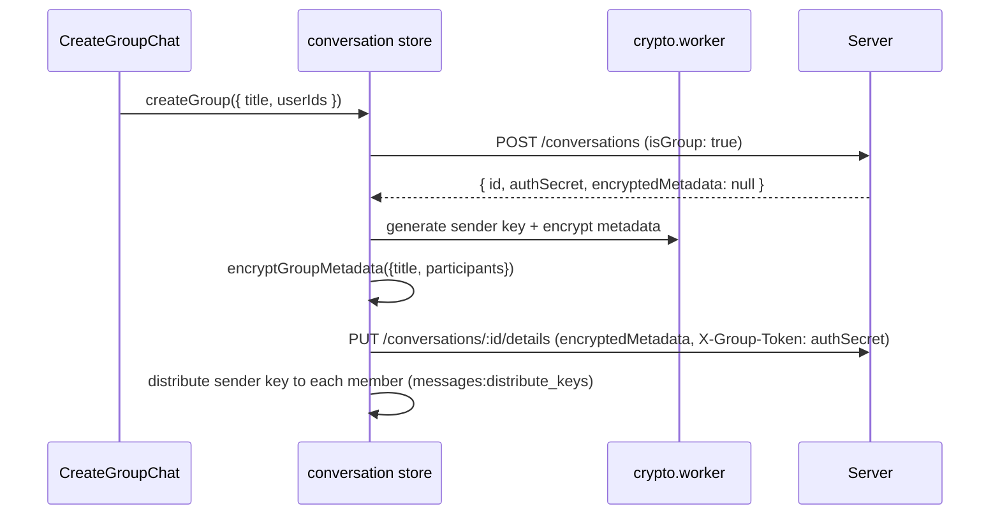

# 16 — Groups

How group conversations are created, how metadata and messages are encrypted, how sender keys are distributed, and how membership changes are handled.

## 16.1 Overview

Groups use the **Sender-Key protocol** (client-side fan-out). The server is a blind relay: it never sees group keys, member names, or message content — only opaque conversation records and ciphertext.

**Key files:** `web/src/store/conversation.ts` (group creation + metadata), `web/src/utils/crypto.ts` (`ensureGroupSession`, `encryptGroupMetadata`, `decryptGroupMetadata`), `web/src/lib/keychainDb.ts` (sender-key state at rest), `web/src/store/message.ts` (group send path), `server/src/routes/conversations.ts`, `server/src/routes/messages.ts`.

## 16.2 Creation flow

- `authSecret` is a blind authorization token: the server checks `X-Group-Token` against it for detail/participant mutations, without knowing who the admin is.
- The group creator distributes its sender key to every participant via `messages:distribute_keys` → persisted as SYSTEM messages so offline members receive keys later.

## 16.3 Metadata encryption & the "Unknown Group" problem

- Group metadata (title, participant list) is encrypted with the creator's sender key at ratchet **N=0**.
- **Decryption-once problem:** the sender-key ratchet advances past N=0 as messages are decrypted. Re-decrypting metadata at N=0 later fails, which would show the group as "Unknown" and hide its messages.
- **Fix (persistence):** after the first successful metadata decrypt, the result is persisted to the Shadow Vault (`saveConversation` → `db.conversations.decryptedMetadata`), so subsequent loads reuse the cache instead of re-decrypting. Participant IDs are additionally cached via `saveCachedGroupParticipants`.

## 16.4 Sender-key distribution & rotation

- Each sender maintains its own chain key `{CK, N, skippedKeys}` per conversation (`groupSenderStates`); each recipient maintains a per-sender receiver state (`groupReceiverStates`) — all encrypted at rest with the `ENC1:` envelope.
- Control message `GROUP_KEY_DISTRIBUTION` carries per-recipient `encryptedKey` + `senderDeviceKey` (and optionally a DR header) — delivered in-band and processed first by the offline sync path.
- **Rotation** (`forceRotateGroupSenderKey`): triggered on participant add/remove, crypto change, or manual "repair secure session".

## 16.5 Membership operations

| Op | Client | Server |
|---|---|---|
| Add participant | `addParticipants` | `POST /:id/participants` (X-Group-Token) → broadcast `conversation:new` |
| Remove participant | `removeParticipant` | `DELETE /:id/participants/:userId` → `conversation:participant_removed` |
| Leave | `deleteConversation` (local) | `DELETE /:id/leave` |
| Delete (admin) | `deleteGroup` | `DELETE /:id` → `conversation:deleted` (only creator can delete; 403 otherwise) |

All membership changes force a sender-key rotation so removed members cannot read future messages (PFS for groups).

## 16.6 Group info & UI

- `GroupInfoPanel` / `EditGroupInfoModal` show/edit the decrypted metadata; `ParticipantList` renders members from the decrypted participant list (with per-user profile enrichment via `useUserProfile`).
- `AddParticipantModal` picks users and triggers the add flow.

## 16.7 Edge cases & invariants

- **Metadata missing → "Unknown":** now mitigated by persisting decrypted metadata; if it still happens, `repairSecureSession` / a ghost sync re-fetches the group key.
- **Member sends before metadata decrypt:** non-creator members reconstruct the participant list from `getCachedGroupParticipants` (opaque-mailbox fallback) so they can send immediately.
- **Key rotation pending:** `requiresKeyRotation` flag + `fireGhostSync` reconcile state after a metadata/participant mismatch.

## 16.8 Files to know

| File | Role |
|---|---|
| `web/src/store/conversation.ts` | `createGroup`, `addOrUpdateConversation`, `updateConversation`, participant ops |
| `web/src/utils/crypto.ts` | `ensureGroupSession`, `encryptGroupMetadata`, `decryptGroupMetadata`, `forceRotateGroupSenderKey` |
| `web/src/lib/keychainDb.ts` | sender/receiver ratchet state, cached participants, at-rest encryption |
| `web/src/lib/messagePipeline.ts` | `GROUP_KEY_DISTRIBUTION` control handling |
| `server/src/routes/conversations.ts` | group endpoints + blind auth (`X-Group-Token`) |
| `server/src/network/redisBridge.ts` | `messages:distribute_keys`, `group:*` events |
