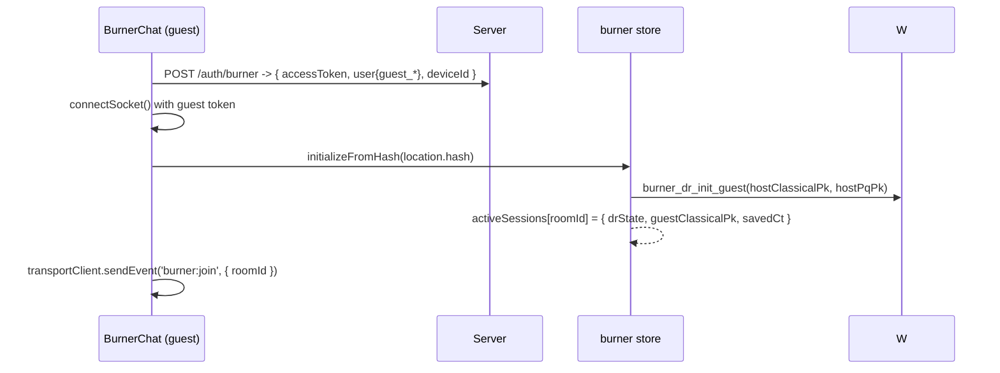

# 17 — Burner Chats

Anonymous, RAM-only, post-quantum encrypted one-off conversations. A registered host generates a link; an anonymous guest joins without creating an account; everything vanishes on close.

**Key files:** `web/src/store/burner.ts`, `web/src/pages/BurnerChat.tsx`, `web/src/components/CreateBurnerModal.tsx`, `web/src/components/ChatWindow.tsx` (destroy), `web/src/lib/socketListeners.ts` (`burner:*` events), `web/src/lib/burnerFileData.ts`, `web/src/workers/crypto.worker.ts` (`burner_dr_*`), `server/src/routes/auth.ts` (`POST /auth/burner`), `server/src/routes/uploads.ts` (`burner-presigned`), `server/src/network/redisBridge.ts` (`burner:*`).

## 17.1 Link generation (host)

```mermaid
sequenceDiagram
    participant M as CreateBurnerModal
    participant B as burner store
    M->>B: generateBurnerLink()
    B->>B: roomId = "burner_" + hex(random 16 bytes)
    B->>B: fetch current device id + host identity/PQ public keys
    B-->>M: URL = origin + "/drop/#roomId:hostUserId:hostDeviceId:pqPk:classicalPk"
    M-->>Host: copy link; add local conversation (BURNER_CHAT)
```

The link embeds the host's public keys (classical + post-quantum) so the guest can initialize the PQ-DR handshake entirely offline of any directory.

## 17.2 Guest join (anonymous)



- The guest is a **`guest_*`** user with role `GUEST` — ephemeral, no DB persistence, no refresh token.
- The PQ-DR init encapsulates against the host's ML-KEM key and computes a hybrid root key (see `burner_dr_init_guest` in the worker).

## 17.3 Message exchange (PQ-DR)

- **Guest → host:** `sendMessage` → `worker_burner_dr_encrypt` → `burner:send { roomId, targetDeviceId, hostUserId, ciphertext }`. The server routes it to the host device (`sendJsonToUser`).
- **Host → guest:** the host's message store path (`message.ts` burner branch) encrypts with the host DR state and sends `burner:reply { roomId, ciphertext }`; the server broadcasts to every member of `burner:room:<roomId>` except the sender.
- The host initializes its side of the DR on the **first** received message (`burner_dr_init_host`) using the guest's classical key + the KEM ciphertext (`savedCt`).

## 17.4 File sharing

- Uploads use `POST /api/uploads/burner-presigned` (anonymous, folder `burner/`, 50 MB cap) → encrypted blob to R2.
- The file JSON rides inside the DR-encrypted message. The parser normalizes **two schemas** (`{fileUrl,fileKey,fileName,fileType,fileSize}` from the guest page and `{url,key,name,size,mimeType}` from the host's main window) via `extractBurnerFileData` in `burnerFileData.ts`.

## 17.5 Termination & destroy

```mermaid
sequenceDiagram
    participant H as Host
    participant S as Server
    H->>S: burner:destroy { roomId, hostUserId }
    S->>S: set burner:terminated:<roomId> = "1" (24h)
    S-->>Members: burner:terminated { roomId }
    H->>H: localStorage burned_<roomId> = true; delete local conversation
```

- **Client-side:** `destroyBurnerSession` blacklists the room locally (`burned_<roomId>` in localStorage), removes the conversation from the store and Shadow Vault, clears RAM messages, emits `burner:destroy`, and redirects to `/chat`.
- **Server-side:** `burner:terminated:<roomId>` makes the room reject further `burner:send`/`burner:reply`.
- **RAM-only:** the guest never persists keys/history; closing the tab destroys everything. A guest reload wipes the previous session first to prevent "split-brain" identity reuse.

## 17.6 Edge cases

- **Host sends before guest's first message:** the host DR state is `CKs: null` until the first incoming guest message initializes it — the UI shows "Waiting for guest to establish secure connection".
- **Zombie messages:** rejected via the `burned_<roomId>` localStorage guard on receive.
- **File preview direction bug (fixed):** host→guest files used to render with no preview because the metadata schema differed; now normalized.

## 17.7 Files to know

| File | Role |
|---|---|
| `web/src/store/burner.ts` | `initializeFromHash`, `sendMessage`, `receiveMessage`, `destroyBurnerSession`, `generateBurnerLink` |
| `web/src/pages/BurnerChat.tsx` | guest UI, upload, socket init, join |
| `web/src/lib/burnerFileData.ts` | file metadata normalization |
| `web/src/workers/crypto.worker.ts` | `burner_dr_init_guest/host`, `burner_dr_encrypt/decrypt` |
| `server/src/routes/auth.ts` | `POST /auth/burner` (guest token) |
| `server/src/routes/uploads.ts` | `POST /uploads/burner-presigned` |
| `server/src/network/redisBridge.ts` | `burner:join/send/reply/destroy` |
