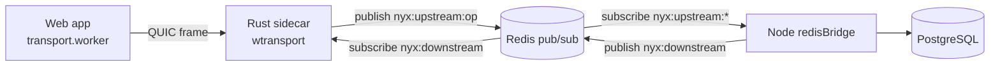

# 18 — Realtime Transport (WebTransport, Redis Bridge, Calls, Push)

NYX uses **WebTransport (HTTP/3 · QUIC)** for all real-time traffic, terminated by a Rust sidecar and bridged to the Node API over Redis pub/sub. This document explains the whole stack and the realtime features layered on top (presence, typing, calls, push).

## 18.1 Architecture

- **Opcode frame:** `[op_code: u8][length: u32 BE][payload]`. Uni-streams carry event frames; datagrams carry small frames (chaff, ICE).
- **Chaff (traffic cover):** the client emits a 1000-byte random datagram (opcode `0x00`) every ~3 s with jitter. The sidecar drops `0x00`. Real frames are never delayed.
- **Message padding:** every user message is padded to 8192 bytes before encryption.

## 18.2 WebTransport worker (`web/src/workers/transport.worker.ts`)

- Connects with URL (+ JWT ticket), optional certificate pin (`serverCertificateHashes`), and device identity (fingerprint + installationId).
- **Auth:** writes an AUTH frame (`[0x00][len][JSON{token, identity}]`) on a bidirectional stream.
- Reads uni-streams, datagrams, and bidirectional streams, then posts `DATA_RECEIVED` frames to the main thread.
- Outbound: `SEND_STREAM`/`SEND_DATAGRAM` (FIFO serialized), `START_HANDSHAKE` (bidi + 5 s timeout).
- Emits `CONNECTED`, `DISCONNECTED`, `ERROR`, `DATA_RECEIVED`, `HANDSHAKE_COMPLETED`.

## 18.3 Rust sidecar (`server/transport-sidecar/src/main.rs`)

- Terminates WebTransport; **one user = one device** (a new session kicks the previous with `KICK` / "Logged in on another device").
- Two auth paths: URL `?ticket=` JWT (HS256, 15 s) or the bidi AUTH frame.
- Three parallel reader loops (bidi / uni-stream / datagram) publish frames to `nyx:upstream:<opcode>`; chaff `0x00` is dropped.
- Subscribes `nyx:downstream`, frames `[op|len|payload]` back to the target session (datagram vs stream via `is_datagram`).
- On connection close, publishes opcode `99` (disconnect) for Node cleanup.
- **Hardcoded opcodes to keep in sync** with `packages/shared/src/transport.ts`: `0x00` CHAFF, `0x07` KICK, `0x0A` HANDSHAKE, `99` disconnect.

## 18.4 Redis bridge (`server/src/network/redisBridge.ts`)

- Maps `TransportOpCode` → handlers: `CHAT_MESSAGE` (persist + relay), `KEY_SYNC` (huge event switch), `WEBRTC_SIGNAL`/`WEBRTC_ICE` (relay), `PRESENCE`, `ACK`, `AUTH` (single-device + hardware binding), `99` disconnect.
- `emitEventToUser(userId, event, data)` wraps named events as a `KEY_SYNC` frame `{event, data}` for legacy compatibility — the client re-maps to the event table in `packages/shared/src/socket.ts`.
- Per-event rate limiting uses the atomic Lua `RATE_LIMIT_LUA`.

## 18.5 Presence & typing

- `online_users` Redis set; join/leave broadcast on connect/disconnect; bulk list sent on `user:active`.
- Typing: `typing:start`/`typing:stop` relayed to explicit `targetRecipients`; rendered via `presence.ts` → `TypingIndicator`.

## 18.6 Calls (WebRTC, P2P)

- Signaling (SDP/ICE) is relayed through the transport (`WEBRTC_SIGNAL`/`WEBRTC_ICE`), wrapped in E2EE (`encryptCallSignal`). The server only pathfinds; media flows P2P.
- `callStore.ts` manages call state (incoming/outgoing, video/audio, streams); `CallOverlay` is the UI.
- TURN credentials come from `GET /api/keys/turn` (Cloudflare TURN; Google STUN fallback).

## 18.7 Push notifications

- `usePushNotifications` subscribes via VAPID; the subscription is sent through the transport (`push:subscribe`).
- `sendPushNotification` (server) encrypts a **per-device payload** (`pushPayloadMap[deviceId]`, ≤ 3000 bytes) — the service worker shows generic text; the app decrypts on open.
- Service worker (`web/src/sw.ts`): `notificationclick` → focus tab + `PWA_ROUTER_NAVIGATE` message; suppressed when already viewing the same chat.

## 18.8 Reconnect & offline sync

- `connection.ts` schedules exponential-backoff reconnect (base 1 s, cap 30 s, jitter), gated on `visibilityState === 'visible'` and an existing access token; `App.tsx`'s visibility handler also reconnects on focus.
- On `connect`, `socketListeners.doSyncMessages` fetches pending messages per conversation (see §15.7).

## 18.9 Files to know

| File | Role |
|---|---|
| `web/src/lib/transportClient.ts` | `NyxWebTransportClient` (EventEmitter wrapper), `connectSocket`, send helpers |
| `web/src/workers/transport.worker.ts` | WebTransport QUIC + chaff + framing |
| `web/src/lib/socketListeners.ts` | main-thread event → store mapping, offline sync |
| `web/src/lib/webrtc.ts` | call signaling, peer connections |
| `web/src/store/connection.ts` | reconnect scheduler, device list |
| `web/src/store/presence.ts`, `callStore.ts` | presence / call state |
| `web/src/sw.ts` | service worker, push handling |
| `server/transport-sidecar/src/main.rs` | QUIC termination, session map, kick |
| `server/src/network/redisBridge.ts` | opcode handlers, presence, relay |
| `server/src/utils/sendPushNotification.ts` | VAPID push |
| `packages/shared/src/transport.ts` | `TransportOpCode` enum |
| `packages/shared/src/socket.ts` | event maps |
