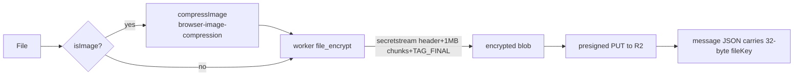

# 19 — Media, Attachments & Stories

How images, videos, files, and voice notes are encrypted, uploaded, cached, decrypted, and rendered — plus the Stories feature.

## 19.1 Attachment encryption (streaming)

- **`file_encrypt`** (`crypto.worker.ts`): libsodium `crypto_secretstream_xchacha20poly1305` — output = `header || chunk(1MB)…` with `TAG_FINAL` on the last chunk. The worker allocates once and streams; it never buffers the whole file.
- **`file_decrypt`** reverses it; truncated files are rejected (missing `TAG_FINAL`).
- The random 32-byte key is delivered **inside the E2EE message metadata** — the server never sees it.
- **View-once media** uses a shorter retention window (`fileRetention`).

## 19.2 Upload path

1. `messageInput.uploadFile` (or `BurnerChat.handleFileUpload` for guests) compresses images, encrypts via the worker, caches the ciphertext to OPFS, requests a presigned URL, and PUTs the blob with `Content-Type: application/octet-stream`.
2. Endpoints: `POST /api/uploads/presigned` (authed, folder `avatars`/`attachments`/`groups`, size caps 5 MB avatar / 100 MB FREE / 500 MB SUBSCRIBER) or `POST /api/uploads/burner-presigned` (anonymous, `burner/`, 50 MB).
3. R2 object key: `{folder}/{userId}-{nanoid}.{ext}` (burner: `burner/{nanoid}.{ext}`). Ephemeral files get a `delete-at` metadata timestamp.

## 19.3 Decrypt & render

- On render, `FileAttachment` / `LazyImage` / `VoiceMessagePlayer` check the RAM `blobCache` first, then OPFS, then fetch the R2 blob, decrypt with the file key, and cache the object URL.
- **OPFS** (`opfsStorage.ts`): 500 MB LRU cache of *encrypted* blobs keyed by file key — avoids re-downloading.
- **RAM blob cache** (`blobCache.ts`): decrypted `blob:` URLs for instant re-render.
- **SVG sanitization:** SVGs are run through DOMPurify after decryption before rendering (XSS guard).
- Preview surface: images via `LazyImage`, PDF via `react-pdf` (`FileAttachment`), video/audio via native elements, others as download cards; gallery/lightbox via `Lightbox`/`MediaGallery`.

## 19.4 Stories

- A story is a single encrypted payload (`storyCrypto.ts` → `encryptStoryPayload` with a per-story `storyKey`).
- `POST /api/stories` (TTL 24 h) → `story.ts` store (`fetchActiveStories`, `postStory`) → `StoryTray` + `StoryViewer`.
- Story keys are stored encrypted at rest (`saveStoryKey`/`getStoryKey`), like other keychain state.
- Story replies are E2EE (`isStoryReplyPayload`).

## 19.5 Media tools (client)

| Component | Purpose |
|---|---|
| `ImageCropperModal` | avatar/story crop (canvas-based, `canvasUtils`) |
| `ImageEditorModal` | paint/annotate (react-sketch-canvas) |
| `AttachmentCropperModal` | attachment crop before staging |
| `Lightbox` / `MediaGallery` | full-screen viewer / chat media grid |

## 19.6 Files to know

| File | Role |
|---|---|
| `web/src/store/messageInput.ts` | upload orchestration, staging, compress |
| `web/src/lib/fileUtils.ts` | `compressImage`, type checks |
| `web/src/lib/r2.ts` | `uploadToR2` |
| `web/src/lib/opfsStorage.ts` | encrypted OPFS cache |
| `web/src/utils/blobCache.ts` | decrypted blob RAM cache |
| `web/src/components/FileAttachment.tsx`, `LazyImage.tsx`, `VoiceMessagePlayer.tsx` | rendering |
| `web/src/lib/storyCrypto.ts` | story encryption |
| `web/src/store/story.ts` | story state |
| `server/src/routes/uploads.ts` | presigned URLs |
| `server/src/routes/stories.ts` | story endpoints |
